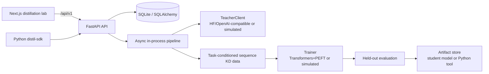

# Distil

Distil turns a capable open-source teacher into a focused student model—or a
standalone code tool—for a specialized job. Choose a teacher, describe the
task, set a target parameter budget, and track synthetic-data generation,
training, evaluation, and artifact packaging from one distillation lab.

Read the [LLM distillation literature review](LITERATURE_REVIEW.md) for the
research background and design rationale.

## Architecture



The default local pipeline is deterministic and GPU-free: a simulated teacher
and trainer produce realistic stage transitions, metrics, and artifacts. Each
simulated stage waits 1.5 seconds by default so progress is visible; override
`PIPELINE_DELAY=0` for fast tests. Set `TEACHER_API_BASE` and
`TEACHER_API_KEY` for an OpenAI-compatible teacher endpoint. For a local
Hugging Face teacher and real LoRA training, install `uv sync --extra train`
and set `TEACHER_LOCAL_MODEL` plus `DISTIL_USE_TRANSFORMERS=1` (optionally
`DISTIL_STUDENT_MODEL`). Real triage runs generate 120 diverse examples by
default, hold out 20% for evaluation, use a consistent chat format, and train
with response-only loss masking for three epochs. Override `DISTIL_EXAMPLES`,
`DISTIL_EPOCHS`, `DISTIL_LORA_R`, or `DISTIL_LEARNING_RATE` for experiments.

## Quickstart

### Backend

```bash
cd backend
uv sync --extra dev
uv run uvicorn app.main:app --reload --port 8000
```

The API persists runs in `backend/distil.db` and artifacts in
`backend/artifacts/` by default.

```bash
curl http://localhost:8000/api/v1/teachers
curl -X POST http://localhost:8000/api/v1/runs \
  -H 'content-type: application/json' \
  -d '{"teacher_id":"phi-4","task_prompt":"Classify support tickets","target_params":1,"output_type":"model"}'
```

### Frontend

```bash
cd frontend
npm install
npm run dev
```

Open <http://localhost:3000>. Next.js proxies `/api/v1/...` to the backend at
`http://localhost:8000` by default, while still falling back to typed mock data
when the backend is unavailable. Set `BACKEND_URL` to point at another backend:

```bash
BACKEND_URL=https://api.example.com npm run dev
```

### Python SDK

```bash
pip install -e sdk/
```

```python
from distil_sdk import Distil

distil = Distil("http://localhost:8000")
run = distil.distill(
    teacher="qwen-2.5-72b",
    task="Extract renewal dates from contracts.",
    target_params=3,
)
run.wait()
print(run.metrics.eval_score)
run.download("./artifacts")
```

See [`backend/README.md`](backend/README.md) and [`sdk/README.md`](sdk/README.md)
for API and client details.

## Verification

```bash
cd backend
uv run pytest
uv run ruff check app tests

cd ../sdk
uv run ruff check distil_sdk

cd ../frontend
npm run lint
npm run build
```
